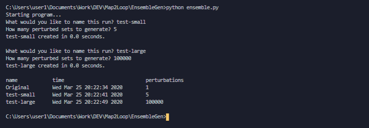

# Ensemble Generator

Object oriented python implementation to coordinate data movement and operations in, and after, map2loop.

## Getting Started

Get the project up and running on your local machine for development and testing. Currently only need pandas with scope for gempy and cython.

### Dependencies

- Python3
- Pandas

## Running

```shell
python ensemble.py
```

## Screenshots

Some examples of expected behaviour.


